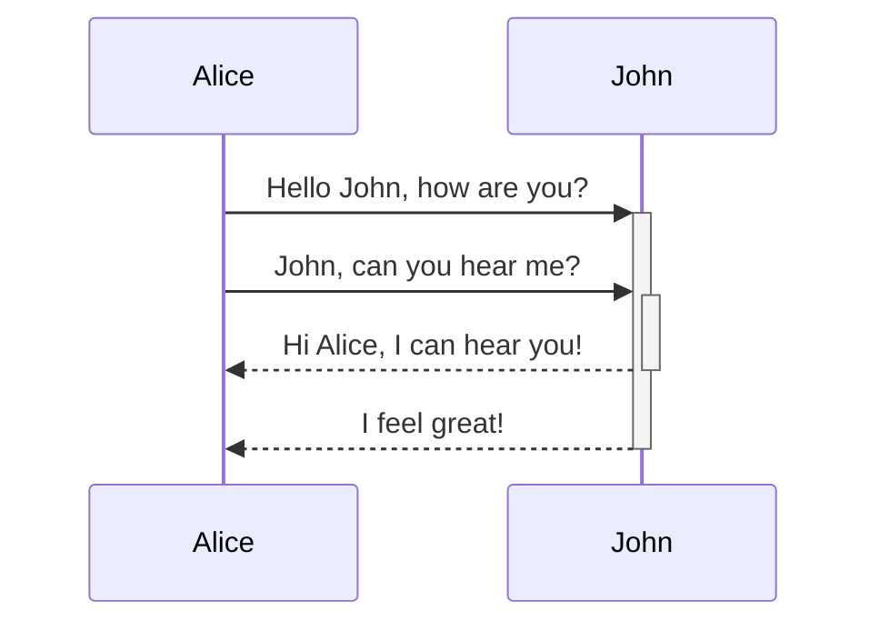
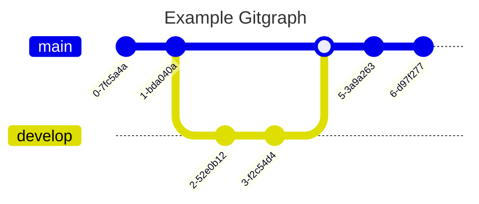
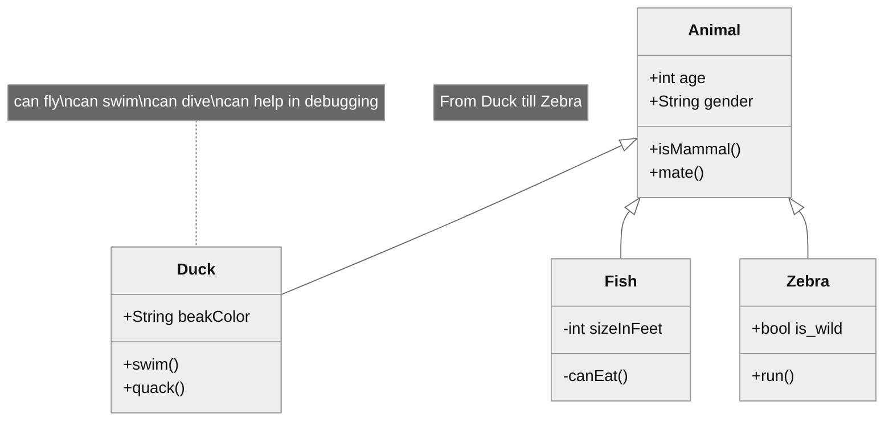

# Headers

# Header 1

## Header 2

### Header 3

#### Header 4

##### Header 5

###### Header 6

### *Formatted* ==heading==

### With $\mathbf{y}=m\mathbf{x}+q$ math

# Formatting

- _Italic_
- **Bold**
- **_Italic bold_**
- ~~Crossed out~~
- ==Highlight==
- Escaping: \*No\* \_Italic\_ \\ Backslashes ok too \\
- You should not see anything after the colon: %%John Cena%%
- [External links](https://wikipedia.com/wiki/Cosmic_web)

> This is a quote.

> This is a long quote.
>
> Someone had a lot of things to say.
>
> Like multiple lines.

> You can quote quotes too.
>
> > Like this.
>
> Then back to normal.

## Lists
- You've seen this above
    - But have you seen nesting?
        - A *lot* of nesting
- Then back to normal

1. Same for numbers
    1. Also nesting
    2. With counting for each level
2. Back to start

- Mixed lists?
    1. We have them
    - Even at the same nesting level
1. They don't quite mix at top level though

- [ ] Task list also work.
- [ ] This one is incomplete.
- [x] This has been completed.
	- [ ] Subtasks are supported
	- [x] Complete or incomplete
- [ ] Last thing

* You can use asterisks for unordered lists too
  * Nested or otherwise
  - Mixing is a bit funky though, try to keep consistent
- Like this

## Horizontal lines
Using ---, ___ and \*\*\*

---

___

***

Same, but with spaces in between, like - - -, _ _ _ and \* \* \*

- - -

_ _ _

* * *

## Tables
| First name | Last name                 | Field               |
| ---------- | ------------------------- | ------------------- |
| Max        | Born                      | *Physics*           |
| Marie      | Curie                     | *Chemistry*         |

| Left-aligned text | Center-aligned text | Right-aligned text |
| :---------------- | :-----------------: | -----------------: |
| Left              |       Center        |              Right |

## Code Blocks

This is `[[inline]] code` in the middle of regular text. Run `curl https://example.com` to waste your time.

```
This is a [[code]] block
**Everything** inside a code block is exempt from rendering
Besides syntax highlighting, of course
```

```javascript
const text = "JavaScript"
console.log(`This is a code block in ${text}`)
// Prints: This is a code block in JavaScript
```

```python
text = "Python"
print(f"This is a code block in {text}")
# Prints: This is a code block in Python
```

```rust
let text = "Rust";
println!("This is a code block in {text}");
// Prints: This is a code block in Rust
```

## Footnotes
This is a footnote, see bottom of the page.[^1]

And a second one.[^2]

This is an *inline* footnote.^[Yet another reference.]

## Callouts
Callouts use the Obsidian syntax.

> [!info] Callouts!
> Content with *actual* formatting inside.

> [!info]
> Default callout titles also work.

> [!info] Empty *callout*

> [!info]

> [!example] Annoying *callout*
> > Nested blockquote to start

> [!example] Another annoying *callout*
> 
> Empty newline to start

> [!info]- Unfold me!
> Callouts can be foldable to avoid taking up tons of space.

> [!question] Question
> Nested callouts work too
> > [!info] Nested!
> > See?
> > > [!quote]- Nested *and* foldable!
> > > It *just* works.

## Math
A **harmonic oscillator** is a system with an equilibrium point that, after undergoing a perturbation, experiences a restoring force $\mathbf{F}$ proportional to the displacement distance $\mathbf{x}$ according to **Hooke's law**:
$$\mathbf{F}=-k\mathbf{x}$$
with $k$ being a positive constant called the **spring constant**. In the small angle approximation, it solves analytically to
$$\boxed{x(t)=x_{0}\cos(\omega t)+ \frac{v_{0}}{\omega}\sin(\omega t)=A\cos(\omega t+\varphi)}$$

# Links
## Regular
- [[Wave equation]] (regular)
- [[Wave equation#Introduction to waves]] (section)
- [[Wave equation|Wavefunction]] (alias)
- [[Wave equation#Introduction to waves|Intro]] (section + alias)
- [[#Callouts]] (internal section)
- [[#Callouts|Cool syntax]] (internal section + alias)

## Embeds
### Pages
![[Block syntax]]

![[Wave equation#Introduction to waves]]

### Media
![[Cat.jpg|300]]

# Mermaid graphs







[^1]: You found the reference!

[^2]: Another reference!